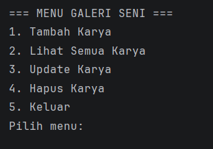
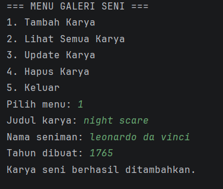
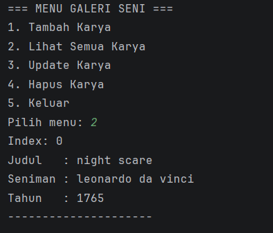
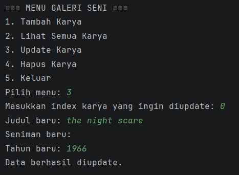
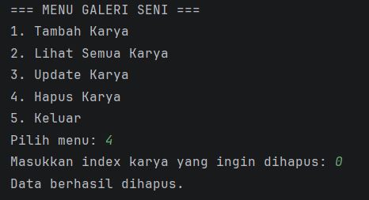

# Program Galeri Seni

## Identitas
Nama : Anindtya Puji Astari  
NIM : 2409106063

---

## Deskripsi Program

Program Galeri Seni merupakan program sederhana berbasis Java yang digunakan untuk menyimpan dan mengelola data karya seni.

Pada program ini pengguna dapat menambahkan, melihat, mengupdate, dan menghapus data karya seni. Program dijalankan melalui console menggunakan menu interaktif.

Data karya seni disimpan menggunakan ArrayList.

---

## Fitur Program

Program memiliki beberapa fitur yaitu:

1. Menambahkan data karya seni
2. Menampilkan seluruh karya seni
3. Mengupdate data karya seni
4. Menghapus data karya seni
5. Keluar dari program

---

## Struktur Program

Program terdiri dari dua class utama yaitu:

### 1. Main.java

Class ini merupakan class utama yang berisi:

- Menu program
- Input dari pengguna
- Pengolahan data karya seni
- Penyimpanan data menggunakan ArrayList

### 2. KaryaSeni.java

Class ini digunakan untuk merepresentasikan objek karya seni.

Atribut yang dimiliki:

- judul
- seniman
- tahun

Class ini juga memiliki method untuk menampilkan data karya seni.

---

## Cara Menjalankan Program

1. Buka project menggunakan IntelliJ IDEA
2. Pastikan file berada dalam folder `src`
3. Jalankan file `Main.java`
4. Program akan menampilkan menu
5. Pilih menu sesuai kebutuhan

---

## Tampilan Program

### Menu Program



---

### Tambah Karya Seni



---

### Lihat Semua Karya



---

### Update Karya



---

### Hapus Karya



---

## Contoh Output Program

```
=== MENU GALERI SENI ===
1. Tambah Karya
2. Lihat Semua Karya
3. Update Karya
4. Hapus Karya
5. Keluar
Pilih menu:
```
