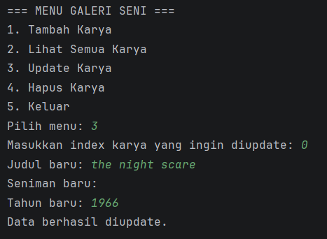

# Program Galeri Seni

## Identitas
Nama : Anindtya Puji Astari  
NIM : 2409106063

---

## Deskripsi Program

Program Galeri Seni merupakan program sederhana berbasis Java yang digunakan untuk menyimpan dan mengelola data karya seni.

Pada program ini pengguna dapat menambahkan, melihat, mengupdate, dan menghapus data karya seni. Program dijalankan melalui console menggunakan menu interaktif.

Data karya seni disimpan menggunakan ArrayList.

Pada posttest ini program dikembangkan dengan menerapkan konsep **Encapsulation** pada class KaryaSeni.

---

## Fitur Program

Program memiliki beberapa fitur yaitu:

1. Menambahkan data karya seni
2. Menampilkan seluruh karya seni
3. Mengupdate data karya seni
4. Menghapus data karya seni
5. Keluar dari program

---

## Struktur Program

Program terdiri dari dua class utama yaitu:

### 1. Main.java

Class ini merupakan class utama yang berisi:

- Menu program
- Input dari pengguna
- Pengolahan data karya seni
- Penyimpanan data menggunakan ArrayList

### 2. KaryaSeni.java

Class ini digunakan untuk merepresentasikan objek karya seni.

Atribut yang dimiliki:

- judul
- seniman
- tahun

Class ini juga memiliki method untuk menampilkan data karya seni.

---

## Penambahan pada Posttest 2

Pada posttest ini dilakukan pengembangan program dengan menerapkan konsep **Encapsulation**.

Encapsulation merupakan konsep dalam pemrograman berorientasi objek yang digunakan untuk menyembunyikan data di dalam class agar tidak dapat diakses secara langsung dari luar class.

### Perubahan yang dilakukan

1. Mengubah atribut pada class KaryaSeni menjadi private.

Sebelumnya atribut dapat diakses langsung, namun sekarang akses dibatasi agar lebih aman.

2. Menambahkan **Getter Method**

Getter digunakan untuk mengambil nilai dari atribut.

3. Menambahkan **Setter Method**

Setter digunakan untuk mengubah nilai dari atribut.

4. Menggunakan **Access Modifier**

Program menggunakan dua jenis access modifier yaitu:

- private pada atribut
- public pada constructor dan method

Dengan penerapan ini data di dalam class tidak dapat diakses langsung dari luar class dan hanya bisa diakses melalui method yang tersedia.

---

## Tampilan Program

### Menu Program


---

### Tambah Karya Seni


---

### Lihat Semua Karya


---

### Update Karya



---

### Hapus Karya


---

## Contoh Output Program

```
=== MENU GALERI SENI ===
1. Tambah Karya
2. Lihat Semua Karya
3. Update Karya
4. Hapus Karya
5. Keluar
Pilih menu:
```
