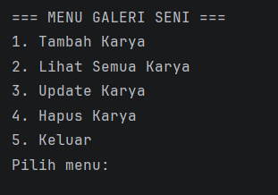
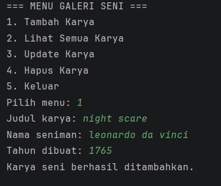
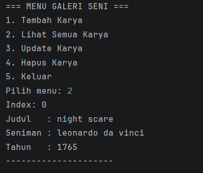
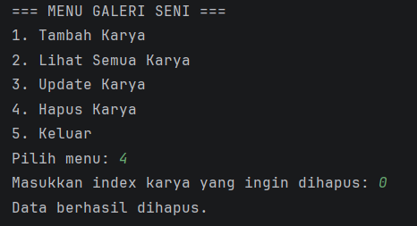

# Program Galeri Seni

## Identitas

Nama : Anindtya Puji Astari
NIM : 2409106063

---

## Deskripsi Program

Program Galeri Seni merupakan program berbasis Java yang digunakan untuk mengelola data karya seni.

Program ini dijalankan melalui console dengan menu interaktif, dimana pengguna dapat menambahkan, melihat, mengupdate, dan menghapus data karya seni.

Data disimpan menggunakan **ArrayList** sehingga dapat dikelola secara dinamis.

Pada posttest ini, program dikembangkan dengan menerapkan konsep **Inheritance (Pewarisan)** dalam pemrograman berorientasi objek.

---

## Konsep yang Digunakan

### 1. Encapsulation

* Atribut pada class dibuat **private**
* Akses menggunakan **getter dan setter**

### 2. Inheritance

Program menggunakan konsep inheritance dimana:

* **Superclass**: `KaryaSeni`
* **Subclass**:

    * `Lukisan`
    * `Patung`
    * `Fotografi`

Setiap subclass memiliki atribut tambahan yang berbeda sesuai jenis karya seni.

---

## Fitur Program

Program memiliki beberapa fitur utama:

1. Menambahkan data karya seni (berdasarkan jenis)
2. Menampilkan seluruh karya seni
3. Mengupdate data karya seni
4. Menghapus data karya seni
5. Keluar dari program

---

## Struktur Program

Program terdiri dari beberapa class:

### 1. Main.java

Berisi:

* Menu program
* Input pengguna
* Pengolahan data
* Penyimpanan data menggunakan ArrayList

---

### 2. KaryaSeni.java (Superclass)

Merepresentasikan data umum karya seni.

Atribut:

* judul
* seniman
* tahun

Method:

* getter dan setter
* tampilData()

---

### 3. Lukisan.java (Subclass)

Turunan dari KaryaSeni.

Atribut tambahan:

* media

---

### 4. Patung.java (Subclass)

Turunan dari KaryaSeni.

Atribut tambahan:

* bahan

---

### 5. Fotografi.java (Subclass)

Turunan dari KaryaSeni.

Atribut tambahan:

* kamera

---


## Tampilan Program

### Menu Program



---

### Tambah Karya (Dengan Pilihan Jenis)



---

### Lihat Karya (Menampilkan Jenis)



---

### Update Karya


---

### Hapus Karya



---

## Contoh Output Program

```
=== MENU GALERI SENI ===
1. Tambah Karya
2. Lihat Semua Karya
3. Update Karya
4. Hapus Karya
5. Keluar
Pilih menu:
```

---

